<h1>
2019 - 2 cuatrimestre - Laboratorio IV -- La Comanda -- Gastón Pesoa
</h1>

<h2><a target="_blank" href="https://pesoagaston.github.io/">Link al sitio</a>
</h2>

<b>Descripción:</b>

   Sistema de servicio de pedidos para restaurante, con dos sectores bien diferenciados: 

   
<ul>
   <li>la barra de tragos y vinos</li>
   <li>cocina, donde se preparan todos los platos de comida</li>
</ul>

Dentro del de trabajadores tenemos empleados diferenciados por

<ul>
   <li>bartender​</li>
   <li>cocineros​</li>
   <li>mozos​</li>
   <li>socios​</li>
</ul>

<h3>Gestión de Comandas</h3>

Cada comanda tiene toda la información necesaria, incluso el nombre del cliente, y es vista por el empleado correspondiente

<b>Operatoria principal:</b>

<ul>
   <li>El cliente ingresa al local y se pone en la lista de espera.</li>
   <li>El mozo rechaza o acepta al cliente y le asigna una mesa.</li>
   <li>El cliente puede ver su mesa asignada y generar un pedido.</li>
   <li>El cliente puede realizar la encuesta de satisfacción.</li>
   <li>El mozo acepta o rechaza el pedido.</li>
   <li>El barman y el cocinero visualizan en su lista de pendientes los menus del pedido que le correspondan.</li>
   <li>El barman y el cocinero toman el pedido.</li>
   <li>El cliente puede visualizar la hora de entrega.</li>
   <li>El barman y el cocinero terminan el pedido.</li>
   <li>El mozo entrega el pedido.</li>
   <li>El cliente confirma la recepción del pedido y puede pagar.</li>
   <li>El cliente paga.</li>
   <li>El mozo confirma el pago, cierra el pedido y libera la mesa.</li>
</ul>

<b>La encuesta de satisfacción califica como Malo, Regular o Bueno:</b>

<ul>
   <li>El servicio</li>
   <li>La comida</li>
   <li>La mesa</li>
</ul>

Y un breve texto con comentarios.

<h3>Descripción técnica:</h3>

El sistema consta de una página web hosteada con Github pages, desarrollada con Angular 8. Como motor de base de datos se utilizó firebase, para persistir la información. El estilo se logró con Angular Material UI

<h3>Modelo de datos:</h3>

<ul>
   <li>
      
<b>Usuarios</b>

      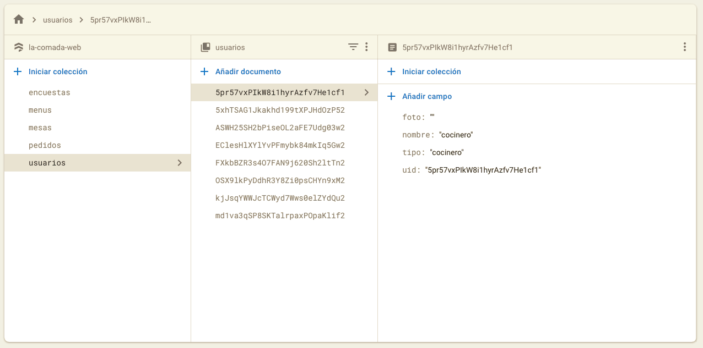
   </li>
   <li>
      
<b>Mesas</b>

      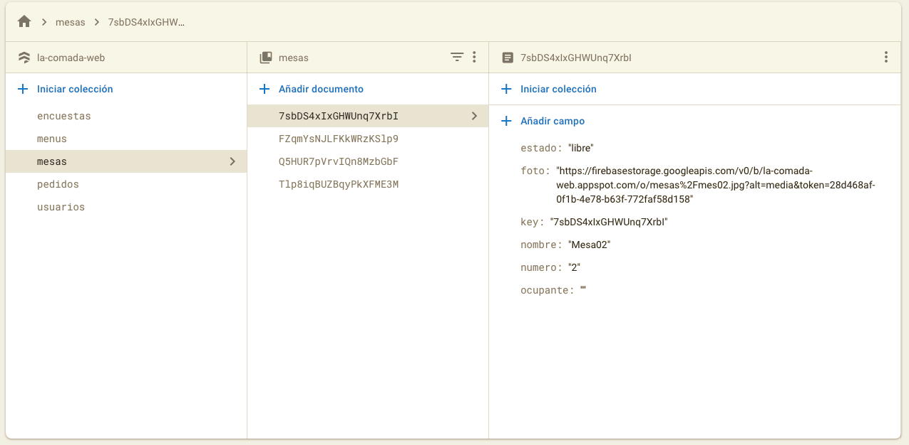
   </li>
   <li>
      
<b>Menus</b>

      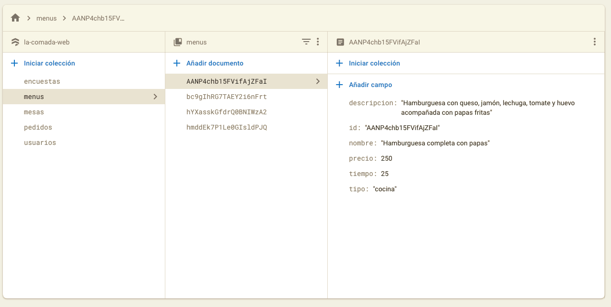
   </li>
   <li>
      
<b>Pedidos</b>

      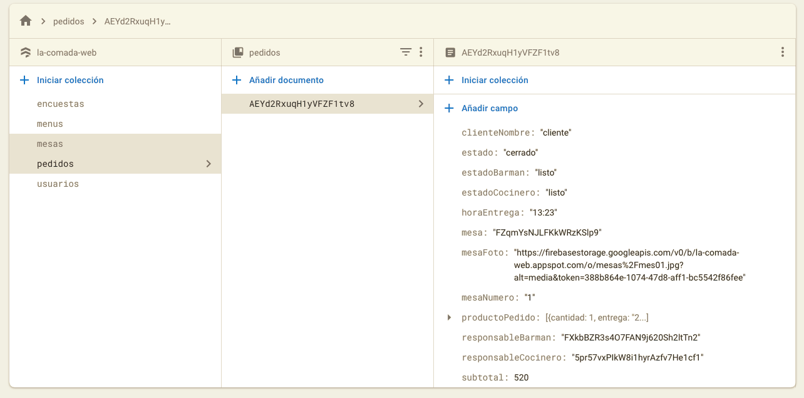
   </li>
   <li>
      
<b>Encuestas</b>

      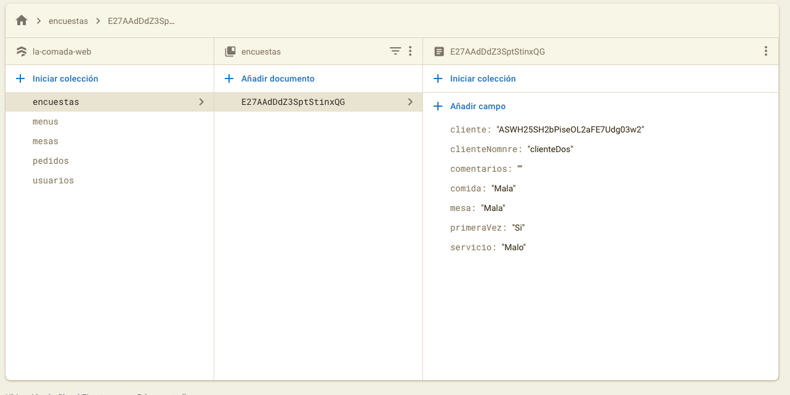
   </li>
</ul>

<h3>Registro de tareas:</h3>

<h4>Sprint 1: 17-10 / 24-10</h4>

Registro, Login con perfiles y pantallas

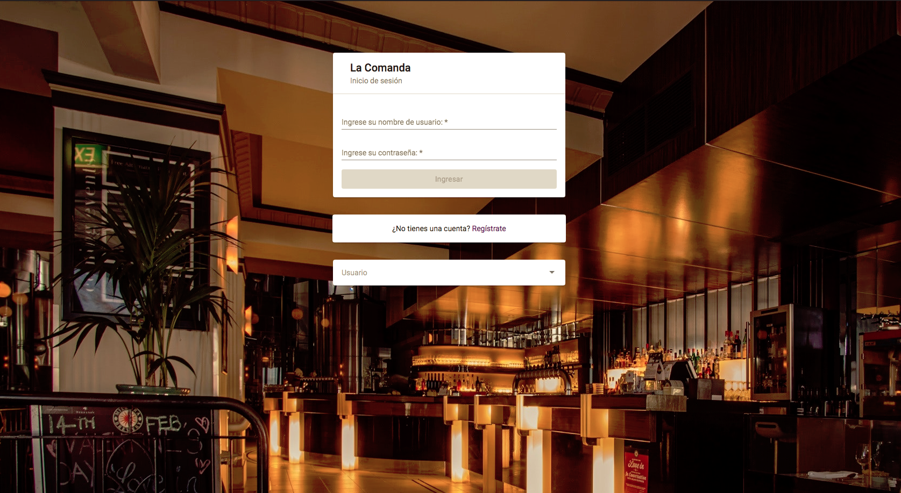
 
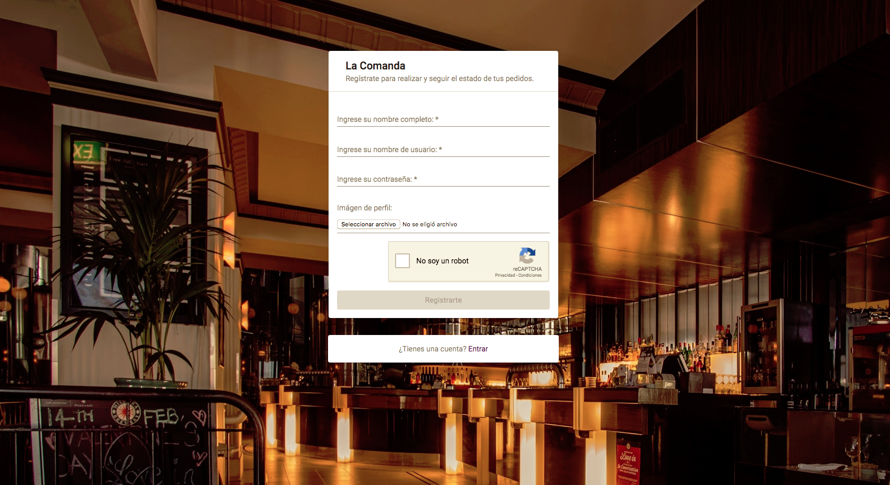
 

<h4>Sprint 2: 24-10 / 31-10</h4>

Configuración de Servicios

<ul>
   <li>Auth</li>
   <li>Firebase</li>
   <li>Parsers</li>
   <li>SnackBar</li>
   <li>Spinner</li>
</ul>

<h4>Sprint 3: 31-10 / 7-11</h4>

Layout

Guards

Toolbar

 

<h4>Sprint 4: 7-11 / 14-11</h4>

Home

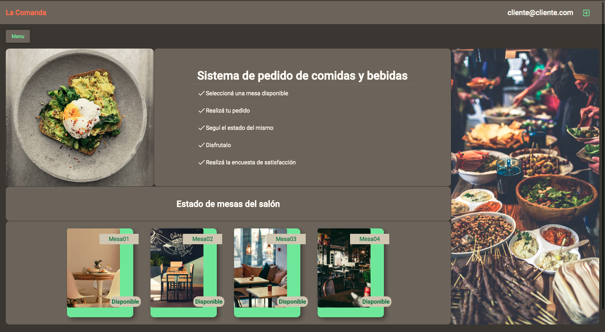
 

Sidenav

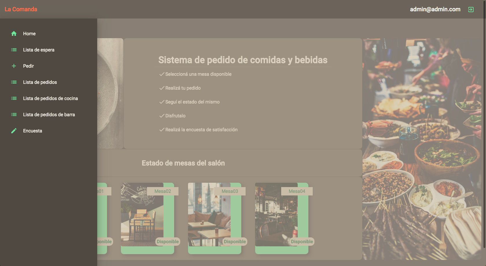
 

<h4>Sprint 5: 14-11 / 21-11</h4>

Home (cliente)

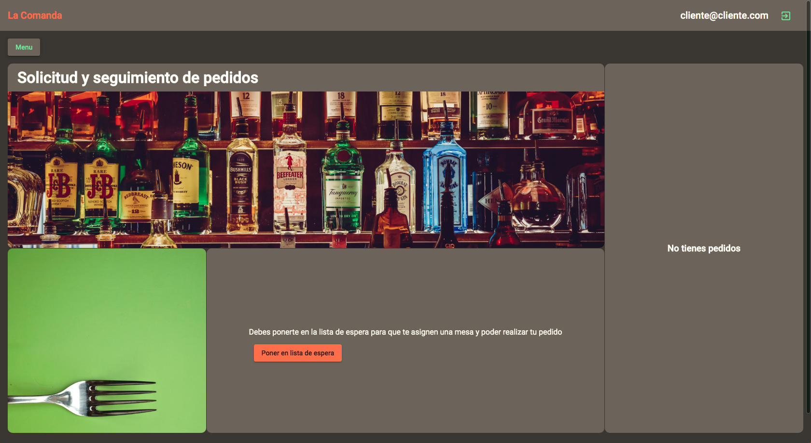
 

Alta pedido (cliente)

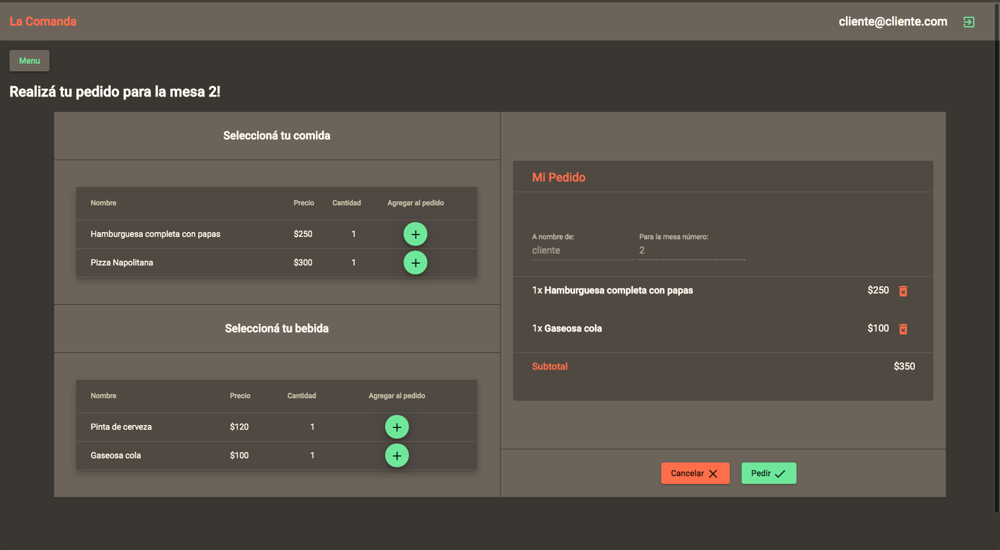
 

Lista de espera (mozo)

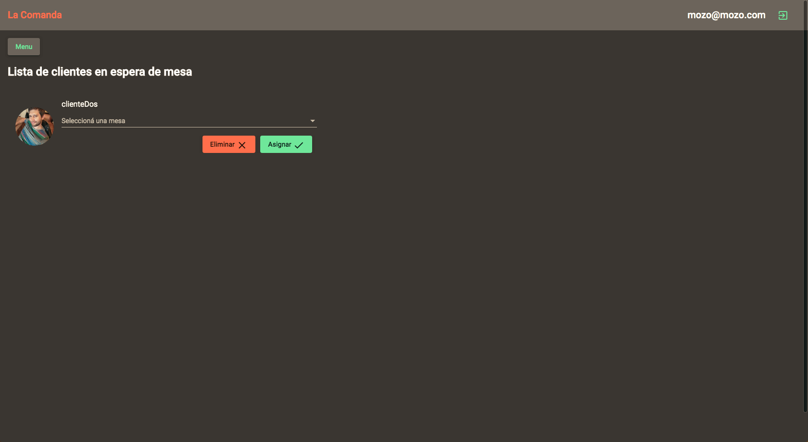
 

Lista de pedidos (mozo)

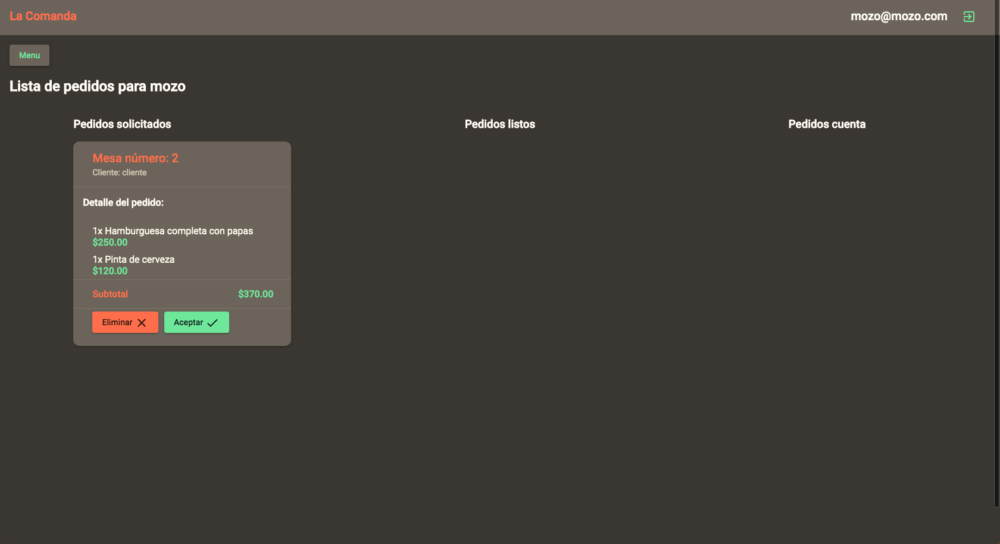
 

<h4>Sprint 6: 21-11 / 28-11</h4>

Lista pedidos barra

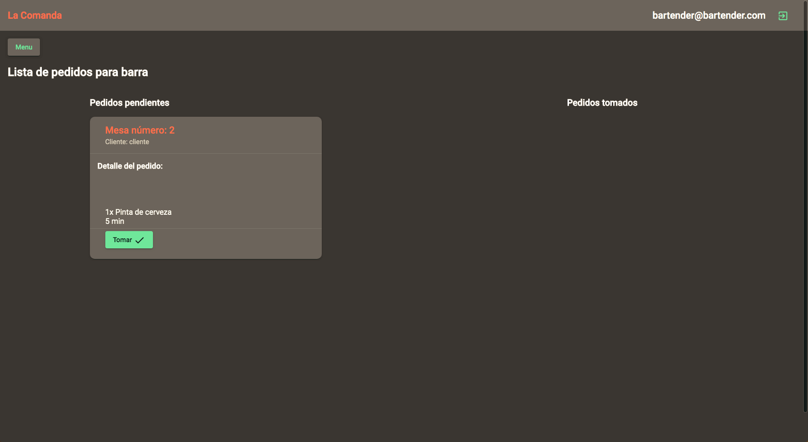
 

Lista pedidos cocina

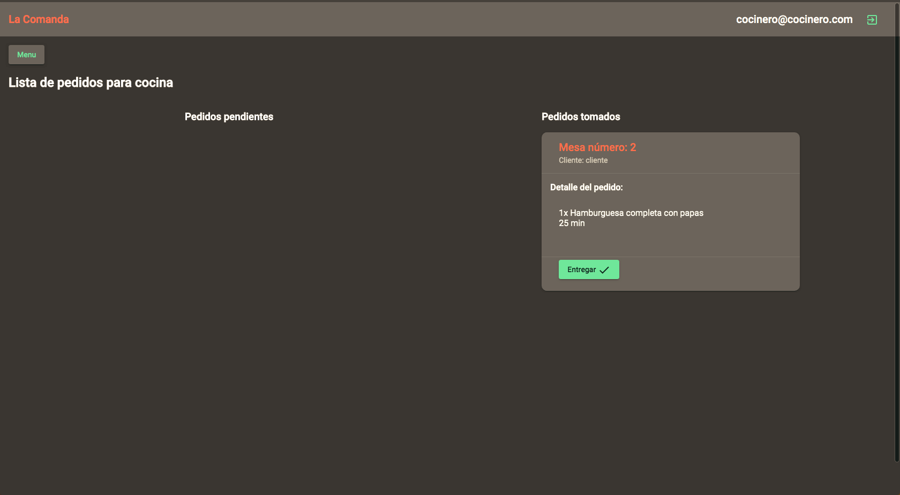
 

Encuesta

 

